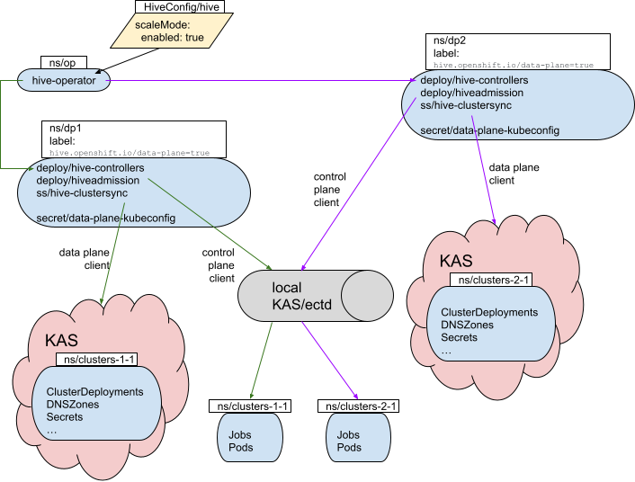

# Scale Mode

[HIVE-1862](https://issues.redhat.com/browse/HIVE-1862)

- [Summary](#summary)
- [Problem Statement](#problem-statement)
- [Proposal](#proposal)
- [Overview](#overview)
- [HiveConfig](#hiveconfig)
- [Namespaces](#namespaces)
  - [On The Hub](#on-the-hub)
    - [Hive Operator](#hive-operator)
    - [Hive Deployments](#hive-deployments)
    - [ClusterDeployment-Related Workloads](#clusterdeployment-related-workloads)
  - [On The Data Plane](#on-the-data-plane)
    - [ClusterDeployment-Related Objects](#clusterdeployment-related-objects)
- [Alternatives](#alternatives)
  - [Reporting Data Plane Status](#reporting-data-plane-status)
  - [Listing Target Namespaces](#listing-target-namespaces)
  - [Replicas vs Separate Controller Stacks](#replicas-vs-separate-controller-stacks)
        
## Summary

As a product that uses hive internally (e.g. ACM), I would like to be able to manage O(100k) ClusterDeployments from a single hub cluster.

## Problem Statement
We can handle roughly 2-3k clusters under a single deployment before running up against limitations such as the maximum size and number of objects one etcd database can store.
As things stand without this enhancement, there are limited options for managing a fleet of "cattle" clusters beyond this scale.
Notably, OSD maintains multiple "shards" -- individual OpenShift clusters each dedicated to managing O(hundreds) of spoke clusters.
Scaling this out entails the expense not only of procuring and maintaining the "hardware" of each hub, but also managing the operation and software stack on each.
OSD has a massive investment in AppSRE and SRE-P to handle this.

Furthermore, OSD hosts these hub shards in the public cloud.
Certain edge scenarios may not have this luxury.
For example, telcos may manage their cattle from baremetal servers under a cell tower.
The cost of scaling out to multiple BM servers is significantly higher than that of growing or adding hub clusters in a cloud.

## Proposal
To get around etcd limits, we propose an architecture whereby as many objects as possible are spread across multiple "data planes" outside of the hub's etcd; and all workloads (containers) are run in the hub "control plane".

**Data Plane:** A virtualized kube API server with its object database isolated from that of the "control plane".
It might be an external OCP cluster.
It might be a database service running on the hub.
It might be $other.
Basically it can be anything that
- Can be connected to via a client built from a kubeconfig
- Responds to k8s CRUD primitives (get, list, watch, create, patch, update, delete)

Importantly, we must assume a data plane _can not_ run workloads (containers).

**Control Plane:** The master "hub" wherein
- The consuming software will run, exposing a UI to the entire fleet of spoke clusters.
- All hive controllers will run.
- Hive will run all "runnables" -- e.g. Job => Pod => Container => install-manager to provision a cluster.

## Overview
hive-operator will learn how to deploy the controller stack (hive-controllers, hiveadmission, hive-clustersync) to more than one target namespace.
In each such namespace it will expect to find a secret containing a kubeconfig providing access to a data plane.
(The data plane must be globally unique to preclude separate controller stacks colliding attempting to reconcile the same object.)
For each k8s CRUD operation hive needs to perform, the controller stack will decide whether the operation involves a workload (container) or not.
Operations involving workloads will be performed in the control plane, using the client based on the controller manager, as normal.
Other operations will be performed in the data plane, using a client constructed from the aforementioned kubeconfig.



([source](https://docs.google.com/drawings/d/1BqpNn3vMBAQItoVWvFh24xZ07AEm5X-O7qe3UNW5OZU/edit))

A video of a live walkthrough of the [PR](https://github.com/openshift/hive/pull/1854) that (at least initially) implements this feature can be found [here](https://drive.google.com/file/d/1hVhMgR35lrpHX_lgx_x83nXxXQv815Im/view).

## HiveConfig
HiveConfig.Spec will grow an additional substruct field, `Spec.ScaleMode`, to hold configuration for this new mode.
Initially the `ScaleMode` substruct will contain a single boolean field, `Enabled`.
When false, hive will operate in normal mode, managing and deploying to the (single) namespace indicated by `Spec.TargetNamespace` (which defaults to `hive` if unspecified).
When true, hive will operate as further described below.
`ScaleMode` and `TargetNamespace` are mutually exclusive; the operator will refuse to deploy any controller stack when both are specified.

The existing `Ready` condition in the `Status.Conditions` list will continue to be used to indicate the overall health of the deployments.
If *any* data plane is unhealthy, the condition's `Status` will be set to `False` and its `Message` will indicate the number of unhealthy data planes.

To provide the same level of detail as currently exists in the Reason/Message when the (singular) targetNamespace is unhealthy, HiveConfig.Status will grow a new field, `TargetNamespaces` comprising a list of the statuses of each targetNamespace.
This is similar in spirit to what we do for syncsets via [ClusterSync.Status](https://github.com/openshift/hive/blob/c04f8ed24a3757b31c5e7c11df421116ad0adf7b/apis/hiveinternal/v1alpha1/clustersync_types.go#L31-L37).
Each list element will contain
- Name (the name of the targetNamespace)
- Result ("Success" or "Failure")
- Reason (similar to that of a Condition)
- Message (ditto)
- LastTransitionTime (ditto)

The list will be sorted first by Result (so the failures are grouped at the top) and second by Name.

We will use this paradigm even when ScaleMode is off: the list will simply have exactly one element.

Example:
```yaml
status:
  conditions:
  - lastProbeTime: "2021-09-20T17:01:01Z"
    lastTransitionTime: "2021-09-20T17:01:01Z"
    message: "1 target namespace(s) did not deploy successfully -- see the 'targetNamespaces' status object for details"
    reason: DeploymentFailure
    status: "False"
    type: Ready
  targetNamespaces:
  - lastTransitionTime: "2022-08-17T18:19:52Z"
    message: Data plane kubeconfig secret data-plane-kubeconfig is missing
    name: data-plane-002
    reason: KubeconfigSecretMissing
    result: Failure
  - lastTransitionTime: "2022-08-17T18:19:52Z"
    message: Namespace deployed successfully
    name: data-plane-001
    reason: SuccessfulDeployment
    result: Success
  - lastTransitionTime: "2022-08-17T18:19:52Z"
    message: Namespace deployed successfully
    name: data-plane-003
    reason: SuccessfulDeployment
    result: Success
```

## Namespaces
The design decisions below are driven by the [OpenShift's documented maximums](https://docs.openshift.com/container-platform/4.10/scalability_and_performance/planning-your-environment-according-to-object-maximums.html); primarily the limit of 10,000 total namespaces per cluster.

### On The Hub
It is assumed that additional namespaces will be used by the consumer to house their operator(s), UI, etc.
Enumerating/describing those is outside the scope of this document.

#### Hive Operator
The hive-operator manages the individual deployments.
It can be deployed to a namespace in the control plane cluster as normal.

#### Hive Deployments
In scale mode, the hive-operator will look for namespaces with the following label:

`hive.openshift.io/data-plane=true`

Upon finding such a namespace, hive-operator will do the following:
- Add the `hive.openshift.io/target-namespace=true` label.
  This allows the operator to discover namespaces it should clean up when the `data-plane` label is removed.
- Look for a Secret called `data-plane-kubeconfig`.
  If not found, hive-operator will consider the namespace broken and not deploy the controller stack; and the HiveConfig `status.targetNamespaces` entry for this namespace will indicate failure.
- Deploy the controller stack -- hive-controllers, hiveadmission, hive-clustersync -- to the namespace with the `data-plane-kubeconfig` secret mounted as a Volume in each pod.

Summary of the **consumer's responsibilities**:
- Create the namespace.
- Stand up the data plane.
  (Note that hive doesn't care where the data plane actually lives.
  In particular, it may or may not be a service running in this namespace.)
- Create the `data-plane-kubeconfig` Secret in the namespace.
- Label the namespace with `hive.openshift.io/data-plane=true`

What with eventual consistency, it's not crucial that the above be done in order; but adding the label last will result in the smoothest transition.
Otherwise HiveConfig may temporarily report `Failure` status for the namespace e.g. if the Secret doesn't exist yet.

As noted above, the consumer can ask hive to tear down the controllers for a data plane by removing the `data-plane` label from that namespace.
Hive will clean up all and only those objects it created when deploying.
(Notably, this does not include the `data-plane-kubeconfig` secret.)
Alternatively, the consumer can simply delete the namespace, which should cause all objects therein to be deleted and garbage collected as normal.
Hive will not destroy spoke clusters managed by the deployment in this namespace.

#### ClusterDeployment-Related Workloads
The **consumer** is responsible for managing (creating and destroying) namespaces in the control plane cluster parallel to (i.e. with the same name as) those in the data planes.
The consumer may manage these in any way it sees fit, with the caveat that the total number of namespaces per OCP cluster is limited to 10,000<sup>[ref](https://docs.openshift.com/container-platform/4.10/scalability_and_performance/planning-your-environment-according-to-object-maximums.html)</sup>.
Since the control plane must have a namespace corresponding to those in every data plane, the consumer must take this limit into account with respect to the total number of namespaces _across all data planes_.
See [below](#clusterdeployment-related-objects) for more details and caveats around this.

(Note that the controllers around ClusterPools are considered "consumers" for purposes of the above.
These controllers will properly handle namespace cloning internally.)

### On The Data Plane
The **consumer** is responsible for deploying a subset of hive including CRDs and any RBAC necessary to allow the user designated by the `data-plane-kubeconfig` to manage them.
However, the hive-operator itself should *not* be deployed to the data plane.

#### ClusterDeployment-Related Objects
The **consumer** is responsible for managing hive objects in the data plane.
The controller stack in the control plane whose `data-plane-kubeconfig` secret points to this data plane will reconcile on those objects in the usual fashion, except that it will run workloads in the [parallel control plane namespace](#clusterdeployment-related-workloads).
The objects in the data plane may be created in any namespace the consumer wishes, while keeping in mind the caveats described above.
In particular, objects of a given Kind sharing a namespace must be uniquely named.
Hive is careful to do so for any objects it creates; the consumer must as well.
But extra care should be taken if a common namespace name is used across multiple data planes.
(Probably best to avoid doing that.)

## Alternatives
### Reporting Data Plane Status
Going from one targetNamespace to many, we needed to consider how to report on the status of each in such a way that the consumer can understand and respond to any problems.
In addition to what we [landed on](#hiveconfig), we considered the following:

- Use the existing Ready condition.
  Make a list (sorted, so we don't thrash) of the namespaces that are failing.
  If nonempty, the condition is set to failure and the message contains the list.

  **Con:** we lose the information about the individual failures.
  The user would have to, what, go look at the logs to get more information?
  Not good UX.

- Similar, but instead of just the names, marshal an array of name+status+reason+message to e.g. a JSON blob and make that the message.

  **Con:** Ugly, difficult to read.
  (Also, are we worried about hitting a limit on the size of an individual string field?)
  **Pro:** It contains all the information.

- Use Events to report failures.
  The Ready condition message can describe how to retrieve those.

  **Con:** Kind of nonstandard, no precedent in hive. Also an extra step to get your info.

### Listing Target Namespaces
We started with a design where target namespaces were enumerated explicitly in HiveConfig, each with a ref to its kubeconfig secret. This ended up being overly complicated and not a great UI/API as it makes HiveConfig theoretically unbounded in size (single object limit? ugly and hard to manage). Also it was a redundant layer of data/logic, as we needed to label the namespaces anyway for cleanup purposes.

### Replicas vs Separate Controller Stacks
We could possibly have tried to do this thing with a single controller stack, with multiple replicas each managing a data plane. A replica could figure out which data plane it owns in a fashion similar to how we divvy up clustersyncs. This would have put all the data plane kubeconfig secrets in the same namespace as the controllers, which could get unwieldy; and it sounds like a nightmare to debug. Also, it would conflict with existing replica scaling capabilities -- e.g. for the clustersync controller.

---
