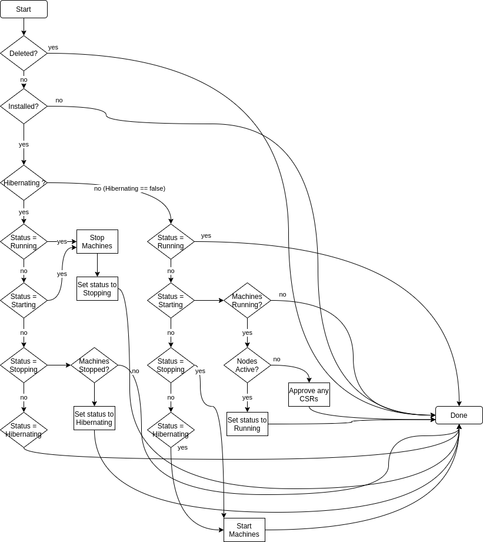

- [Hibernating Clusters](#hibernating-clusters)
	- [Overview](#overview)
	- [Example Commands](#example-commands)
		- [ClusterDeploymentStatus](#clusterdeploymentstatus)
			- [PowerState](#powerstate)
			- [Conditions](#conditions)
				- [Reason](#reason)
				- [Status](#status)
		- [ClusterDeploymentSpec](#clusterdeploymentspec)
			- [PowerState](#powerstate-1)
			- [HibernateAfter](#hibernateafter)
	- [Cluster Hibernation Controller](#cluster-hibernation-controller)
		- [Selecting Cluster Machines](#selecting-cluster-machines)
		- [Hibernation Actuator](#hibernation-actuator)
		- [Handling Incompatible Cloud Provider](#handling-incompatible-cloud-provider)
		- [Approving CSRs](#approving-csrs)
		- [Resuming from a Hibernating State](#resuming-from-a-hibernating-state)
	- [OpenStack Hibernation](#openstack-hibernation)

# Hibernating Clusters

## Overview

Starting with OpenShift version 4.4.8, clusters can be stopped and started by simply shutting
down their machines and starting them back up. The only additional requirement to bring a cluster
back up from a stopped state is that CSRs be approved for the cluster's nodes when certificates
have expired since the cluster was active. This typically happens if the cluster is hibernated
within the first 24 hours before initial cert rotation takes place. After this phase, certs will
be valid for 30 days.

Hive can automate the process of stopping/starting clusters via its API by allowing the user to
set a the desired state of the cluster in the ClusterDeployment spec. Both API and controller
changes are required to support this feature.

## Example Commands

```bash
$ oc patch cd mycluster --type='merge' -p $'spec:\n powerState: Hibernating'
$ oc patch cd mycluster --type='merge' -p $'spec:\n powerState: Running'
```

### ClusterDeploymentStatus

The ClusterDeploymentStatus defines the observed state of a ClusterDeployment.

Two noteworthy parameters of ClusterDeploymentStatus include:
* PowerState - indicates the observed ClusterPowerState of the cluster
* Conditions - provides further details regarding the status of the cluster

```go

type ClusterDeploymentStatus struct {
	// ... other fields

	// PowerState indicates the powerstate of cluster
	// +optional
	PowerState ClusterPowerState `json:"powerState,omitempty"`

	// Conditions includes more detailed status for the cluster deployment
	// +optional
	Conditions []ClusterDeploymentCondition `json:"conditions,omitempty"`
}
```
#### PowerState

The following are stable ClusterPowerStates:

```go
type ClusterPowerState string

const (
	// ClusterPowerStateRunning indicates that all machines are running.
	// This is the default state of a cluster after installation has completed
	ClusterPowerStateRunning ClusterPowerState = "Running"

	// ClusterPowerStateHibernating indicates that the machines belonging to a cluster
	// are stopped.
	ClusterPowerStateHibernating ClusterPowerState = "Hibernating"

```

The following indicate a terminal error with the power state of the cluster:

```go
type ClusterPowerState string

const (

	// ClusterPowerStateFailedToStartMachines indicates a failure to start cloud VMs
	ClusterPowerStateFailedToStartMachines ClusterPowerState = "FailedToStartMachines"

	// ClusterPowerStateFailedToStop indicates that stopping machines for hibernation
	// resulted in an error
	ClusterPowerStateFailedToStop ClusterPowerState = "FailedToStop"
)
```

Finally, the following denote transitionary or waiting states that can occur before a stable state is reached:

```go
type ClusterPowerState string 

const (
	// ClusterPowerStateSyncSetsNotApplied indicates SyncSets have not yet been applied
	// for the cluster. This state is derived from ClusterSync.Status.FirstSuccessTime
	ClusterPowerStateSyncSetsNotApplied ClusterPowerState = "SyncSetsNotApplied"

	// ClusterPowerStateStartingMachines indicates an attempt to list and start cloud VMs
	ClusterPowerStateStartingMachines ClusterPowerState = "StartingMachines"

	// ClusterPowerStateStopping indicates the cluster is transitioning
	// from a Running state to a Hibernating state.
	ClusterPowerStateStopping ClusterPowerState = "Stopping"

	// ClusterPowerStateWaitingForMachinesToStop is used when waiting for cloud VMs to stop
	ClusterPowerStateWaitingForMachinesToStop ClusterPowerState = "WaitingForMachinesToStop"

	// ClusterPowerStateWaitingForMachines is used when waiting for cloud VMs to start
	ClusterPowerStateWaitingForMachines ClusterPowerState = "WaitingForMachines"

	// ClusterPowerStateWaitingForNodes is used when waiting for nodes to become Ready
	ClusterPowerStateWaitingForNodes ClusterPowerState = "WaitingForNodes"

	// ClusterPowerStatePausingForClusterOperatorsToSettle is used when pausing to let ClusterOperators start and post new status before we check it.
	ClusterPowerStatePausingForClusterOperatorsToSettle ClusterPowerState = "PausingForClusterOperatorsToSettle"

	// ClusterPowerStateWaitingForClusterOperators is used when waiting for ClusterOperators to
	// get to a good state. (Available=True, Processing=False, Degraded=False)
	ClusterPowerStateWaitingForClusterOperators ClusterPowerState = "WaitingForClusterOperators"

	// ClusterPowerStateUnknown indicates that we can't/won't discover the state of the cluster's cloud machines.
	ClusterPowerStateUnknown = "Unknown"
)
```


#### Conditions
The ClusterDeploymentCondition details additional information about the state
of the cluster, and has the following typical structure:

```go
// ClusterDeploymentCondition contains details for the current condition of a cluster deployment
type ClusterDeploymentCondition struct {
	// ... other fields

	// Type is the type of the condition.
	Type ClusterDeploymentConditionType `json:"type"`
	// Status is the status of the condition.
	Status corev1.ConditionStatus `json:"status"`
	// Reason is a unique, one-word, CamelCase reason for the condition's last transition.
	// +optional
	Reason string `json:"reason,omitempty"`
}
```
The Type combined with the Status is the primary indicator of the state.

Example:

```yaml
status:
  ...
  conditions:
  - ...
    status: "False"
    type: Hibernating
```

When the Hibernating condition is False it means that the cluster is not hibernating.

The Ready and Hibernating status conditions should be considered in combination to determine the state of a cluster. If the Status of either is True, the cluster is in a stable state (either hibernated or running). When both are False, the cluster is transitioning between stable states, and the Reason and Message fields will provide more details.

##### Reason
The following parameters can be used for the Reason section of ClusterDeploymentCondition: 

```go
// Cluster hibernating and ready reasons
const (
	// HibernatingReasonResumingOrRunning is used as the reason for the Hibernating condition when the cluster
	// is resuming or running. Precise details are available in the Ready condition.
	HibernatingReasonResumingOrRunning = "ResumingOrRunning"
	// HibernatingReasonStopping is used as the reason when the cluster is transitioning
	// from a Running state to a Hibernating state.
	HibernatingReasonStopping = string(ClusterPowerStateStopping)
	// HibernatingReasonWaitingForMachinesToStop is used on the Hibernating condition when waiting for cloud VMs to stop
	HibernatingReasonWaitingForMachinesToStop = string(ClusterPowerStateWaitingForMachinesToStop)
	// HibernatingReasonHibernating is used as the reason when the cluster is in a
	// Hibernating state.
	HibernatingReasonHibernating = string(ClusterPowerStateHibernating)
	// HibernatingReasonUnsupported is used as the reason when the cluster spec
	// specifies that the cluster be moved to a Hibernating state, but the cloud provider of
	// the cluster is not supported.
	HibernatingReasonUnsupported = "Unsupported"
	// HibernatingReasonFailedToStop is used when there was an error stopping machines
	// to enter hibernation
	HibernatingReasonFailedToStop = string(ClusterPowerStateFailedToStop)
	// HibernatingReasonSyncSetsNotApplied is used as the reason when SyncSets have not yet been applied
	// for the cluster based on ClusterSync.Status.FirstSucessTime
	HibernatingReasonSyncSetsNotApplied = string(ClusterPowerStateSyncSetsNotApplied)
	// HibernatingReasonSyncSetsApplied means SyncSets have been successfully applied at some point.
	// (It does not necessarily mean they are currently copacetic -- check ClusterSync status
	// for that.)
	HibernatingReasonSyncSetsApplied = "SyncSetsApplied"
	// HibernatingReasonPowerStatePaused indicates that we can't/won't discover the state of the
	// cluster's cloud machines because the powerstate-paused annotation is set.
	HibernatingReasonPowerStatePaused = "PowerStatePaused"
	// HibernatingReasonClusterDeploymentDeleted indicates that a Cluster Deployment has been deleted
	// and that the cluster is deprovisioning unless preserveOnDelete is set to true.
	HibernatingReasonClusterDeploymentDeleted = "ClusterDeploymentDeleted"

	// ReadyReasonStoppingOrHibernating is used as the reason for the Ready condition when the cluster
	// is stopping or hibernating. Precise details are available in the Hibernating condition.
	ReadyReasonStoppingOrHibernating = "StoppingOrHibernating"
	// ReadyReasonStartingMachines is used to reflect attempt to list and start cloud VMs
	ReadyReasonStartingMachines = string(ClusterPowerStateStartingMachines)
	// ReadyReasonFailedToStartMachines is used when there was an error starting machines
	// to leave hibernation
	ReadyReasonFailedToStartMachines = string(ClusterPowerStateFailedToStartMachines)
	// ReadyReasonWaitingForMachines is used on the Ready condition when waiting for cloud VMs to start.
	ReadyReasonWaitingForMachines = string(ClusterPowerStateWaitingForMachines)
	// ReadyReasonWaitingForNodes is used on the Ready condition when waiting for nodes to become Ready.
	ReadyReasonWaitingForNodes = string(ClusterPowerStateWaitingForNodes)
	// ReadyReasonPausingForClusterOperatorsToSettle is used on the Ready condition when pausing to let ClusterOperators start and post new status before we check it.
	ReadyReasonPausingForClusterOperatorsToSettle = string(ClusterPowerStatePausingForClusterOperatorsToSettle)
	// ReadyReasonWaitingForClusterOperators is used on the Ready condition when waiting for ClusterOperators to
	// get to a good state. (Available=True, Processing=False, Degraded=False)
	ReadyReasonWaitingForClusterOperators = string(ClusterPowerStateWaitingForClusterOperators)
	// ReadyReasonRunning is used on the Ready condition as the reason when the cluster is running and ready
	ReadyReasonRunning = string(ClusterPowerStateRunning)
	// ReadyReasonPowerStatePaused indicates that we can't/won't discover the state of the
	// cluster's cloud machines because the powerstate-paused annotation is set.
	ReadyReasonPowerStatePaused = "PowerStatePaused"
	// ReadyReasonClusterDeploymentDeleted indicates that a Cluster Deployment has been deleted
	// and that the cluster is deprovisioning unless preserveOnDelete is set to true.
	ReadyReasonClusterDeploymentDeleted = "ClusterDeploymentDeleted"
)
```

##### Status 

```go
type ConditionStatus string

// These are valid condition statuses. "ConditionTrue" means a resource is in the condition.
// "ConditionFalse" means a resource is not in the condition. "ConditionUnknown" means kubernetes
// can't decide if a resource is in the condition or not. In the future, we could add other
// intermediate conditions, e.g. ConditionDegraded.
const (
	ConditionTrue    ConditionStatus = "True"
	ConditionFalse   ConditionStatus = "False"
	ConditionUnknown ConditionStatus = "Unknown"
)
```

### ClusterDeploymentSpec

As opposed to the ClusterDeploymentStatus, which indicates the current state of the ClusterDeployment,
the ClusterDeploymentSpec defines the _desired_ state of the ClusterDeployment.

ClusterDeploymentSpec has two noteworthy fields that are relevant to hibernation:

```go
// ClusterDeploymentSpec defines the desired state of ClusterDeployment
type ClusterDeploymentSpec struct {
	// ... other fields

	// PowerState indicates whether a cluster should be running or hibernating. When omitted,
	// PowerState defaults to the Running state.
	PowerState ClusterPowerState `json:"powerState,omitempty"`

	// HibernateAfter will transition a cluster to hibernating power state after it has been running for the
	// given duration. The time that a cluster has been running is the time since the cluster was installed
	// the time since the cluster last came out of hibernation.
	HibernateAfter *metav1.Duration `json:"hibernateAfter,omitempty"`
}
```
#### PowerState
The PowerState indicates the _desired_ power state of the cluster. 

* To hibernate a running cluster, set this field to "Hibernating".
* To resume a hibernating cluster, set this field to "Running".

#### HibernateAfter
The HibernateAfter field will hibernate a cluster after a given duration (specified by a [time.Duration](https://pkg.go.dev/maze.io/x/duration#ParseDuration) value).
Set this field to the given amount of time you wish for the cluster to stay in Running.
Once this time has passed, the cluster will transition to the Hibernating state.

NOTE: While this parameter is set, each time the cluster is resumed post-hibernation,
it will only remain running for the given duration.

## Cluster Hibernation Controller
The cluster hibernation controller is a controller that watches the ClusterDeployments and ensures that the target cluster's
machines reflect the hibernating state specified in the ClusterDeployment spec.

High level flow of controller logic:



The controller uses the actuator pattern to power up and power down machine instances as well as determining
machine state (running or stopped).

### Selecting Cluster Machines

Option 1 (Preferred):
The hibernation controller relies on the actuator to select machines used by the cluster.
The actuator, given a ClusterDeployment's InfraID selects machines using a method appropriate to the cloud provider (tags/name prefix/resource group).

Option 2:
The hibernation controller uses the machine API on the target cluster to determine which machines belong to the cluster. It then stores the machine IDs
in the clusterdeployment (or a separate CR), then uses those machine IDs to start the cluster again.

### Hibernation Actuator
The hibernation controller relies on an actuator to work with cloud provider machines.
This is the interface for the actuator:

```go
type HibernationActuator interface {
  // CanHandle returns true if the actuator can handle a particular ClusterDeployment
  CanHandle(cd *hivev1.ClusterDeployment) bool

  // StopMachines will start machines belonging to the given ClusterDeployment
  StopMachines(logger log.FieldLogger, cd *hivev1.ClusterDeployment, hiveClient client.Client) error

  // StartMachines will select machines belonging to the given ClusterDeployment
  StartMachines(logger log.FieldLogger, cd *hivev1.ClusterDeployment, hiveClient client.Client) error

  // MachinesRunning will return true if the machines associated with the given
  // ClusterDeployment are in a running state.
  MachinesRunning(logger log.FieldLogger, cd *hivev1.ClusterDeployment, hiveClient client.Client) (bool, error)

  // MachinesStopped will return true if the machines associated with the given
  MachinesStopped(logger log.FieldLogger, cd *hivev1.ClusterDeployment, hiveClient client.Client) (bool, error)
}
```

### Handling Incompatible Cloud Provider
The hibernation controller will set the Hibernating condition to `false` and set the reason
to Unsupported if the cluster's cloud provider is not currently supported.

### Approving CSRs
In the case that CSRs must be approved for a cluster that has had its certificates expired while hibernating,
we should follow similar checks as the [cluster machine approver](https://github.com/openshift/cluster-machine-approver/blob/0f50c7bfe9b309ce01937274598f5a807d9545df/csr_check.go)
to ensure we are not introducing an additional security exposure.

### Resuming from a Hibernating State
The unreachable controller tracks the reachability of a cluster and is responsible for updating the `Unreachable` status condition accordingly.

Once a cluster hibernates and stops responding, the unreachable controller sets the `Unreachable` condition's `Status` to `True`.

Once the cluster resumes, the unreachable controller sets the condition `False` and the hive controllers are free to resume syncing.

## OpenStack Hibernation
OpenStack hibernation deletes cluster instances while preserving the ability to restore them. Unlike other cloud providers, OpenStack lacks native hibernation, therefore an implementation based on snapshots is necessary.

While OpenStack provides shelving functionality, replicating true hibernation behavior similar to other cloud providers is difficult and often not possible depending on the OpenStack deployment configuration. Hive's snapshot-based approach provides a universally compatible solution that works with any OpenStack setup.

OpenStack hibernation pauses the instances, creates snapshots of all instances, saves their complete configuration into a secret (CD namespace), and deletes the instances, completely freeing all project resources consumed by the cluster.

Restoration recreates instances with identical attributes to their original state, including tags and metadata.

Due to the specific nature of the snapshot based implementation, the hibernation and restoration process inherently requires more time to finish compared to other cloud providers, approximately 10 minutes for each, creating the snapshots during hibernation and restoring the instances from the snapshots taking majority of the time.

Instance snapshots (Images) do not take from the project's quota and are being cleaned up after each Hibernation cycle (worker snaphots can only be deleted once the worker instance dissappears)