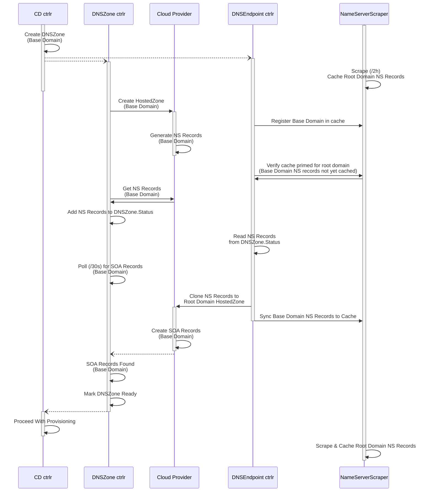

# Managed DNS Internals

- [New Cluster Sequence](#new-cluster-sequence)
- [Flow](#flow)
- [dnsendpoint controller](#dnsendpoint-controller)
  - [nameServerScraper](#nameserverscraper)
- [clusterdeployment controller:](#clusterdeployment-controller)
  - [DNSZone](#dnszone)

## New Cluster Sequence

## Flow
- CD controller reconciles CD.
  If ManageDNS is true, creates DNSZone (spec.zone = cd.spec.baseDomain)
- DNZone controller reconciles DNSZone.
  Decides whether to sync.
  If we've never synced OR the `ZoneAvailable` condition is missing/false, we'll sync.
  If the dnsZone.status.lastSyncGeneration doesn't match the dnsZone's current generation, we'll sync. **Thus anything that bumps the dnsZone's generation will trigger a resync!**
  (Looking in OSD, lastSyncGeneration is 1 for all dnsZones, so I don't think this is happening, wrt thrashing.)
  Otherwise we'll force sync every 2h.
- Platform-specific actuator methods:
  - `Refresh()` ([AWS](https://github.com/openshift/hive/blob/110dabc9a4c0bb5460c18f278d2dd78fc8f97287/pkg/controller/dnszone/awsactuator.go#L193))
    - Finds hosted zone in cloud provider, adds the zone to the actuator, adds the zone ID to DNSZone.Status.
    - Looks up tags, adds to actuator
    - **oddity:** First time, we look up by tag: in theory we could get multiple hits. Only the "last" one will stick.
  - `Exists()` ([AWS](https://github.com/openshift/hive/blob/110dabc9a4c0bb5460c18f278d2dd78fc8f97287/pkg/controller/dnszone/awsactuator.go#L538)) verifies that `Refresh()` found the zone by checking for it in the actuator.
  - If DNSZone marked for deletion, `Delete()` ([AWS](https://github.com/openshift/hive/blob/110dabc9a4c0bb5460c18f278d2dd78fc8f97287/pkg/controller/dnszone/awsactuator.go#L424))
    - deletes RecordSets
    - deletes zone
    - removes finalizer
    - bails
  - Else ensure DNSZone finalizer
  - If zone wasn't found above, `Create()` ([AWS](https://github.com/openshift/hive/blob/110dabc9a4c0bb5460c18f278d2dd78fc8f97287/pkg/controller/dnszone/awsactuator.go#L330))
    - Creates hosted zone. Name is the dnsZone.spec.zone (== baseDomain). CallerReference is dnsZone UID.
    - Fetches existing tags, adds them to actuator
    - Syncs tags.
      - Ensures we have a `hive.openshift.io/dnszone="dnszoneNamespace/dnszoneName"` tag
      - **Additional tag support:** Adds any DNSZone.Spec.AWS.AdditionalTags (not used by OSD)
  - Else (zone was found): `UpdateMetadata()` ([AWS](https://github.com/openshift/hive/blob/110dabc9a4c0bb5460c18f278d2dd78fc8f97287/pkg/controller/dnszone/awsactuator.go#L83)) just syncs tags as above.
  - `GetNameServers()` ([AWS](https://github.com/openshift/hive/blob/110dabc9a4c0bb5460c18f278d2dd78fc8f97287/pkg/controller/dnszone/awsactuator.go#L497)) queries the cloud provider for the list of NS records associated with the hosted zone ID/name
- Use dns lib to look up SOA for the zone name (aka basedomain)
- Update dnsZone.status:
  - set nameServers
  - set `ZoneAvailable` condition. True iff SOA was available. **This is what enables provisioning to proceed.**
  - set `lastSyncGeneration` to the dnsZone's generation.
    This helps inform whether we should sync next time
- If SOA was not available, requeueAfter 30s; else exit (wait to be re-poked)

## dnsendpoint controller
Has three watches:
- DNSZone
- CD => DNSZone (by labels? Why not just append `-zone` to the name?)
- `nameServerChangeNotifier`, a channel fed by a `nameServerScraper`

Its reconciler does the following:
- Grabs the DNSZone
- Grabs the nameServerScraper for the root domain (e.g. p1...)
- Makes sure the nameServerScraper is "seeded" with this subdomain (basedomain, e.g. mycluster.p1...). This informs the nameServerScraper that it needs to pay attention to this subdomain and populate its cache entry the next time it runs.
- Checks whether the nameServerScraper has scraped this subdomain yet.
  If it hasn't, bail without requeueing.
  We'll rely on the scraper to poke this controller once it has scraped.
  If it has:
  - If the cache matches the dnszone, set the `ParentLinkCreated` condition based on whether there are NS entries or not.

### nameServerScraper

One per `managedDomains` entry (as configured via HiveConfig).
In OSD, one `managedDomains` entry represents all managed domains for a single cloud provider: we have one for aws and one for gcp.
Each has exactly one entry in its `domains` list.

Run every 2h unless otherwise poked.

Initially seeded with all root domains. This ensures we do a full scrape on startup.

[scrape()](https://github.com/openshift/hive/blob/119dad4528777c46948c2b3e3bd48dde97d7efa6/pkg/controller/dnsendpoint/nameserverscraper.go#L224):
- Retrieves **all** NS entries for subdomains of the root domain
- Syncs the cache with them.
  - If a cache entry exists for a subdomain that the dnsendpoint controller has reconciled on, check whether the cache's NS list (which came from the DNSZone -- **initially empty!**) differs from what we just retrieved from the cloud.
    If so, enqueue the dnsZone to be reconciled by the dnsendpoint controller (via `nameServerChangeNotifier`).

## clusterdeployment controller:
These things are only done if [cd.Spec.ManageDNS](https://github.com/openshift/hive/blob/903546686f6109e4c0389d72893cf0272a00e2cb/vendor/github.com/openshift/hive/apis/hive/v1/clusterdeployment_types.go#L147) is set:
- Sync settings from CD to DNSZone (PreserveOnDelete, log annotations).
  If the DNSZone doesn't exist yet, that's okay, no-op for now.
- [ensureManagedDNSZone](https://github.com/openshift/hive/blob/4e6537d7de35377b4d4fdc9adf7646560d40fc0e/pkg/controller/clusterdeployment/clusterdeployment_controller.go#L1605):
  - Platform check: AWS, GCP, or Azure. Anything else, set the `DNSNotReady` status condition and bail.
  - Create DNSZone if it doesn't exist
  - Requeue until the DNSZone's `ZoneAvailable` condition becomes `True`.
    Parlay this into the CD's `DNSNotReady` condition, which we set to `False` (double negative :eyeroll:)
  - We'll keep waiting up to 10m, at which point we'll give up, setting the CD's `ProvisionStopped` condition with reason `DNSNotReadyTimedOut`.

**TODO:** Document the cleanup flow.

### DNSZone
[Source](../vendor/github.com/openshift/hive/apis/hive/v1/dnszone_types.go)

CR used only for managed DNS.

We name it `${cdname}-zone`.

The important spec bit is the `Zone` field, which contains the base domain of the cluster -- same as the `cd.spec.baseDomain`.

(Aside: `linkToParentDomain` appears to always be `true`.)

The status includes:
- Zone identifier (`aws.zoneID` / `gcp.zoneName`) in the cloud provider
- `nameServers`: list of NS records.
  **This is the thing we're waiting for from the cloud provider.**
  Once we see this, we update the `ZoneAvailable` status condition, which is how the `hive_cluster_deployment_dns_delay_seconds` metric is [computed](https://github.com/openshift/hive/blob/4e6537d7de35377b4d4fdc9adf7646560d40fc0e/pkg/controller/clusterdeployment/clusterdeployment_controller.go#L1532)

**TODO:** Document status conditions, which are complicated.
