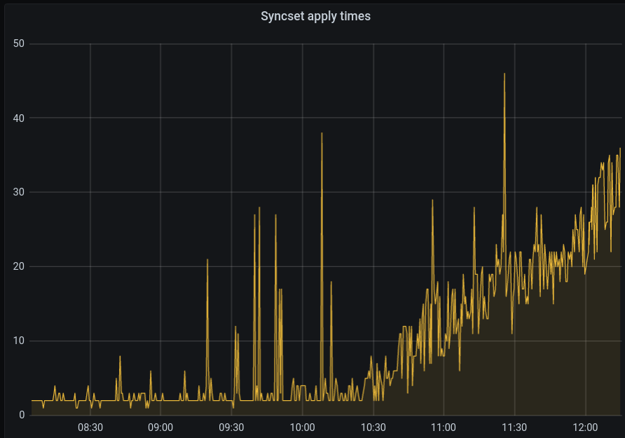

# Scaling Hive

This document offers suggestions for running Hive at large scale. In addition to presenting overall considerations for scaling Hive, the document will describe the main places users are likely to see scalability issues with Hive.

We scale test Hive using AWS, so this document will refer primarily to AWS instance types and storage concepts.

## Hive uses CRDs!

Most importantly, be aware that Hive uses CRDs to store its state. The amount of data that Hive can store is limited by the cluster's ability to store CRs. In OpenShift, this boils down to "how much data can we stuff into etcd before the cluster itself becomes unstable?" Best to not chance it. We recommend keeping the total number of Hive CRs in a Hive cluster in the thousands. Anything approaching 10,000 is the danger zone. In practice this means that a single Hive cluster should manage no more than 1000 clusters.

# Horizontal vs. Vertical Scale

With the exception of install pods (used only when clusters are installing), Hive 1.x is not horizontally scalable at the worker level with the exception of the [clustersync and machinepool controllers](using-hive.md#scaling-clustersync-and-machinepool).
Most of the work Hive does happens in the hive-controllers pod, which is one single pod on one single worker.
This means that when no installs are running, if you have a cluster with 10 workers, 9 of the workers are very bored.
Hive clusters are prime candidates for using worker autoscaling.
Keep the worker count as low as you can, but allow bursts of concurrent installs to call for temporary workers to spin up.

See [using hive](using-hive.md#vertical-scaling) for information about vertically scaling the hive-controllers, hive-clustersync, hive-machinepool, and hiveadmission pods themselves.

In AWS, Hive performs best on C (CPU Optimized) instance types. Hive performs fine on M (General purpose) instances, but C instances are better.

In general, the faster your etcd storage, the faster Hive will perform. c5.4xlarge has twice the EBS bandwidth as c5.2xlarge, and so Hive performs a bit better on c5.4xlarge (although in our opinion, not so much faster that c5.4xlarge is worth the premium over c5.2xlarge). In AWS, we recommend using io1 EBS volumes with 1,200 IOPS for the etcd volumes attached to the masters.

If you need to scale out the number of clusters you need to manage, use multiple Hive clusters, with each single Hive cluster managing no more than 1000 clusters.

You should also take into account your business considerations. For example, if you are building a control plane that is distributed across geographic regions or is following the pattern of cell-based architecture, you may wish to partition Hive clusters across multiple regions and cap the number of clusters managed per region. In the event of a region or datacenter outage, you would only lose the ability to manage a portion of your managed clusters.

## Install Pods

Hive 1.x requests 800 Mib of memory for each install pod. If you use m5.xlarge workers, you can support about (15 Gib / 800 Mib) install pods per worker -- so about 16. If you need to support more concurrent installs, you can use more workers, and/or workers with more memory. Install pods use barely any CPU.

## Blocking I/O

hive-controllers (where the controllers run) uses blocking i/o. By default, each controller uses 5 goroutines (although this is configurable in HiveConfig). To use an example, if all 5 threads for the hibernation controller (the controller that powers clusters on and off) are waiting on HTTP responses from remote managed clusters, then no other hibernation work can be done until at least one of those requests returns to free up a thread.

As a potential scale improvement in the future, we may consider moving to scale-out or non-blocking i/o.

## Threads

Hive supports configuring the number of goroutines per controller by editing values in HiveConfig. See [Using Hive](using-hive.md) for documentation on this. The default is 5 goroutines per controller.

In a busy Hive cluster, over the life of the cluster, the SyncSet controller (clustersync) is the controller that does most of the work. The other controllers are bored compared to clustersync. For that reason, it helps to simplify things and think mostly about the clustersync controller. The other controllers can be left to use the default 5 goroutines in most cases. If you have hundreds of SyncSets and hundreds of managed clusters, the default of 5 clustersync threads in a single replica will probably not be enough.

The goal of anyone looking to push Hive to its limits should be to the keep CPU utilization for the worker where hive-controllers runs as close to 100% as possible.

We have found that we get the highest CPU utilization (and thus best overall performance) when we roughly match the number of clustersync threads to the number of vCPUs on the worker. If we use less, the CPU is bored. If you have only 10 clustersync goroutines but 100 vCPUs, 90 of the vCPUs will be mostly unused. If we have 36 CPUs but only 20 clustersync threads, CPU utilization is usually 50%. If we more closely match them (40 threads for 36 vCPU), CPU utilization tends to be in the high 90's. If we use too many threads (100 threads for 36 vCPU), we still get high CPU utilization, but the overall performance actually slows down. We assume this is golang overhead of too many threads / thread management. Don't just set clustersync goroutines to 1000 or some arbitrary high number, or performance will actually suffer.
If vertical scaling is not sufficient, or if you simply wish to distribute the load of the clustersync controller, consider [scaling horizontally](using-hive.md#scaling-clustersync-and-machinepool).
 
If Hive manages clusters that are on slow networks or have frequent connectivity issues, you may want to use a few extra clustersync goroutines to work around Hive's use of blocking i/o. If you manage clusters that are occasionally offline, a SyncSet request that takes 30 seconds to timeout means that a clustersync thread is doing nothing for 30 seconds. (Eventually Hive will mark that cluster as unreachable and stop attempting to apply SyncSets to it, so this is only real concern if you manage a large amount of slow or occasionally-offline clusters.)

## SyncSet Performance

Pushing configuation to managed clusters via SyncSets is the most CPU-intensive and network-intensive thing that Hive does. We scale test Hive by mostly looking at how SyncSets perform because that is where we typically see performance bottlenecks. This makes sense because, post-installation, applying SyncSets is what Hive spends the majority of its time doing.

The primary metric we judge SyncSet performance by is "applies per second". The following table lists some typical applies/sec rates for various AWS instance type combinations we've tested.

|control-plane nodes|worker nodes|goroutines|applies/sec|
|---|---|---|---|
|c5.2xlarge|c5.2xlarge|20|700|
|c5.2xlarge|c5.2xlarge|40|700|
|c5.4xlarge|c5.4xlarge|20|1200|
|c5.4xlarge|c5.4xlarge|40|1400|
|c5.2xlarge|c5.4xlarge|20|1470|
|c5.2xlarge|c5.9xlarge|20|1750|
|c5.2xlarge|c5.9xlarge|40|2500|
|c5.2xlarge|c5.9xlarge|50|2500|
|c5.4xlarge|c5.24xlarge|100|2400|

## Thread Starvation

The secondary metric we judge SyncSet performance by is "apply time per syncset". Generally syncsets apply very quickly (seconds). In a properly loaded and scaled Hive cluster, Hive should be able to apply a newly-created SyncSet for a single cluster within seconds. Hive should also be able to apply a single newly-created SelectorSyncSet that applies to 1000 clusters in a few minutes.

If you see SyncSet apply times taking much longer than this, Hive is probably thread-starved and needs more clustersync goroutines and/or replicas (and probably more vCPUs for its worker -- see above for the recommendation to roughly match vCPUs to clustersync goroutines).

Here is an example graph from a scale test where Hive is running on an m5.xlarge instance in AWS, using the default of 5 clustersync goroutines. In this scale test, Hive contains 60 SelectorSyncSets for every managed cluster. The test creates a new cluster every 60 seconds over 5 hours. For the first few hours of the test, Hive applies SyncSets quickly -- within 2 minutes after installation is complete. However, a few hours into the test, we see SyncSet apply times start to degrade. Towards the end of the test, once 200+ clusters are installed, some SyncSet applies are taking 30 minutes or longer. This indicates thread starvation. Once Hive had to apply SyncSets to about 150 clusters, the clustersync controller no longer had enough threads to keep up.

